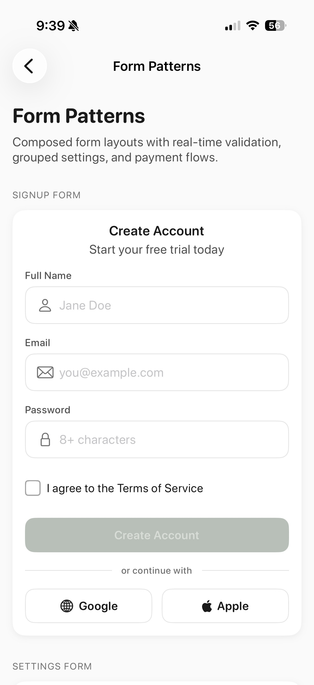
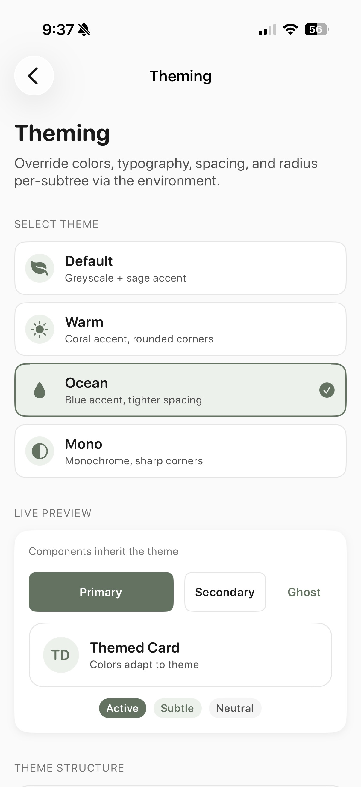
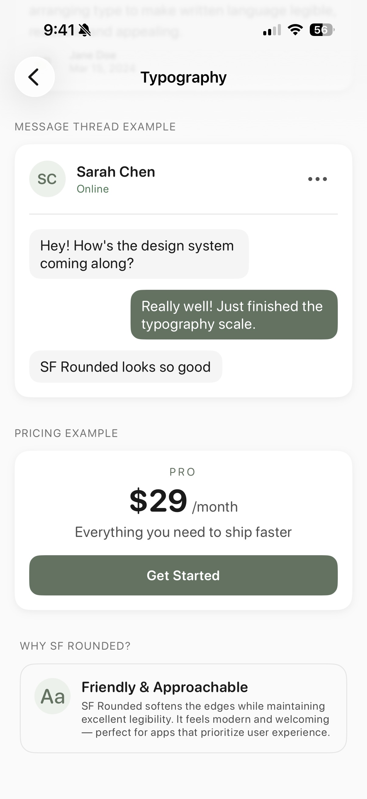
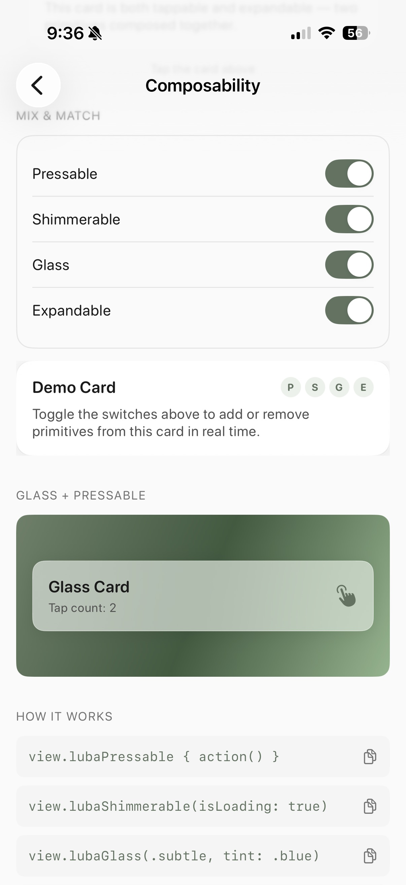
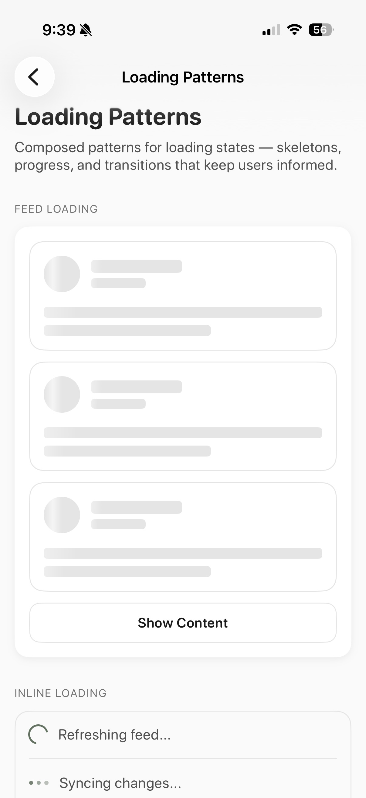

# LubaUI

**Ship beautiful SwiftUI apps without thinking about design.**

You're building fast. You're vibing with your AI. You don't want to stop and think about what shade of gray a subtitle should be, whether your button animation is too bouncy, or if your touch targets meet accessibility standards. You want to write `LubaButton("Save") { save() }` and have it just *feel right*.

That's LubaUI.


<p align="center">
  
  &nbsp;
  
  &nbsp;
  
  &nbsp;
  
  &nbsp;
  
</p>

---

## 30-Second Demo

```swift
import SwiftUI
import LubaUI

struct ContentView: View {
    @State private var email = ""
    @State private var agreed = false

    var body: some View {
        VStack(spacing: LubaSpacing.lg) {
            Text("Create Account")
                .font(LubaTypography.title)
                .foregroundStyle(LubaColors.textPrimary)

            LubaTextField.email(text: $email)

            LubaCheckbox(isChecked: $agreed, label: "I agree to the terms")

            LubaButton("Get Started", style: .primary, isDisabled: !agreed) {
                createAccount()
            }
        }
        .padding(LubaSpacing.xl)
    }
}
```

No color codes. No animation curves. No magic numbers. It just looks and feels like a real app.

---

## Installation

### Swift Package Manager

**Xcode:** File → Add Package Dependencies → Enter:
```
https://github.com/ermanakar/LubaUI
```

**Package.swift:**
```swift
dependencies: [
    .package(url: "https://github.com/ermanakar/LubaUI", from: "0.2.0")
]
```

> **0.2.0 is prepared but not yet tagged.** Until the tag is published, point at
> the branch to get the theming, Reduce Motion, Dynamic Type, and localization
> work described below — `from: "0.1.0"` resolves to the pre-theming release:
>
> ```swift
> .package(url: "https://github.com/ermanakar/LubaUI", branch: "main")
> ```

---

## Why LubaUI

### Built for AI-Assisted Development

Every token, every constant, every API in LubaUI is designed to be understood by your AI coding assistant. Semantic naming (`LubaColors.textPrimary`, not `gray900`), strict tokenization (no magic numbers), and documented rationale for every design decision. When you pair with an AI, it doesn't guess — it *knows* this system.

### One Import, Whole Design Language

You get colors, typography, spacing, motion, haptics, accessibility, and 35+ components that all share the same DNA. Your settings screen looks like it belongs with your onboarding flow because they're built from the same tokens.

### The Details Are Done

The hard stuff is already decided:
- **0.97 press scale** — not 0.98 (too subtle), not 0.95 (too cartoonish)
- **Spring animations** tuned to feel alive, not mechanical
- **4pt spacing grid** for mathematical rhythm
- **44pt touch targets** for accessibility compliance
- **Adaptive colors** that look right in light and dark mode

You don't have to make these decisions. They're already made, and they're good.

---

## Primitives — Make Anything Interactive

This is the core idea. Behaviors aren't locked inside components — they're modifiers you can attach to *any* view.

### `.lubaPressable()` — Tap anything

```swift
// A card that feels like a button
LubaCard {
    Text("Tap me")
}
.lubaPressable { print("Tapped!") }

// An image that responds to touch
Image("hero")
    .lubaPressable(scale: 0.98) { showDetail = true }
```

### `.lubaSwipeable()` — Swipe actions on any row

```swift
// Swipe to delete
MessageRow()
    .lubaSwipeable(trailing: [.delete { removeItem() }])

// Multiple actions
MessageRow()
    .lubaSwipeable(
        leading: [.pin { pinMessage() }],
        trailing: [.archive { archive() }, .delete { delete() }]
    )
```

### `.lubaLongPressable()` — Long press with progress

```swift
// Destructive action with visual confirmation
Image(systemName: "trash")
    .lubaLongPressable { confirmDeletion() }

// With progress ring
LubaCard { content }
    .lubaLongPressable(showProgress: true, duration: 1.0) {
        confirmDeletion()
    }
```

### `.lubaShimmerable()` — Loading state for any view

```swift
// Shimmer anything while loading
Image("hero")
    .lubaShimmerable(isLoading: isLoading)
```

### `LubaExpandable` — Accordion behavior

```swift
LubaExpandable(isExpanded: $isOpen) {
    Text("FAQ Question")
} content: {
    Text("The answer goes here")
}
```

---

## Components

### Interactive Controls

| Component | What It Does |
|-----------|-------------|
| `LubaButton` | Primary, secondary, ghost, destructive, subtle. Loading states. Icons. |
| `LubaTextField` | Labels, icons, error states. Convenience: `.email()`, `.secure()` |
| `LubaTextArea` | Multi-line text editor with character counter and limits |
| `LubaSearchBar` | Search input with cancel button and submit handler |
| `LubaCheckbox` | Animated checkmark with label |
| `LubaRadio` | Radio button groups |
| `LubaToggle` | iOS-style toggle switch |
| `LubaSlider` | Value slider with optional labels |
| `LubaStepper` | Numeric +/- adjuster with configurable range and step |
| `LubaRating` | Star rating control with read-only display mode |
| `LubaTabs` | Segmented control with matched geometry animation |
| `LubaIconButton` | Icon buttons with 44pt touch targets |

### Layout & Containers

| Component | What It Does |
|-----------|-------------|
| `LubaCard` | Container with elevation levels. Compose with `.lubaPressable()` |
| `LubaSheet` | Bottom sheets with size presets and drag indicator |
| `LubaDivider` | Horizontal/vertical dividers with optional labels |

### Feedback & Status

| Component | What It Does |
|-----------|-------------|
| `LubaToast` | Info, success, warning, error notifications with auto-dismiss |
| `LubaAlert` | Inline notification banner with semantic styles |
| `LubaProgressBar` | Linear progress indicator |
| `LubaCircularProgress` | Circular progress indicator |
| `LubaSpinner` | Arc, pulse, dots, and breathe loading styles |
| `LubaBadge` | Status badges with semantic colors |
| `LubaTooltip` | Contextual help popup with auto-dismiss |

### Data Display

| Component | What It Does |
|-----------|-------------|
| `LubaAvatar` | Image or initials with size variants |
| `LubaIcon` | Standardized icon sizing with semantic colors |
| `LubaCircledIcon` | Icons with circular backgrounds |
| `LubaSkeleton` | Shimmer loading placeholders (text, circle, card, row) |
| `LubaChip` | Dismissible filter/tag pill with selection state |
| `LubaLink` | Inline text link with default, subtle, and external styles |
| `LubaMenu` | Context menu with icons and destructive item support |

### Data Visualization

| Component | What It Does |
|-----------|-------------|
| `LubaBarChart` | Vertical/horizontal bar chart with token-based styling |
| `LubaGroupedBarChart` | Multi-series grouped bar chart with auto palette |
| `LubaLineChart` | Line chart with optional area fill and point markers |
| `LubaMultiLineChart` | Multi-series line chart |
| `LubaPieChart` | Pie and donut chart (iOS 17+, uses `SectorMark`) |
| `LubaSparkline` | Minimal inline trend chart for dashboards |
| `LubaChartSkeleton` | Animated loading placeholder (bar/line styles) |
| `LubaChartLegend` | Custom legend row for chart labels |

---

## Design Tokens

Every value has a name. No magic numbers.

### Colors
```swift
LubaColors.textPrimary       // Main text
LubaColors.textSecondary     // Supporting text
LubaColors.accent            // Brand color (sage green)
LubaColors.success           // Positive states
LubaColors.warning           // Caution states
LubaColors.error             // Error states
LubaColors.surface           // Card backgrounds
LubaColors.background        // Page backgrounds
```

All colors are adaptive — they switch automatically between light and dark mode.

### Spacing (4pt base grid)
```swift
LubaSpacing.xxs   // 2pt
LubaSpacing.xs    // 4pt
LubaSpacing.sm    // 8pt
LubaSpacing.md    // 12pt
LubaSpacing.lg    // 16pt
LubaSpacing.xl    // 24pt
LubaSpacing.xxl   // 32pt
LubaSpacing.xxxl  // 48pt
LubaSpacing.huge  // 64pt
```

### Motion
```swift
LubaMotion.pressScale        // 0.97 — the sweet spot
LubaMotion.pressAnimation    // Quick spring with bounce
LubaMotion.stateAnimation    // Smooth state transitions
LubaMotion.micro             // Ultra-quick feedback
LubaMotion.gentle            // Soft transitions
LubaMotion.disabledOpacity   // 0.45
```

### Typography
```swift
LubaTypography.largeTitle    // SF Rounded by default
LubaTypography.title
LubaTypography.headline
LubaTypography.body
LubaTypography.caption
// ... 15 roles total, every one Dynamic Type-aware
```

---

## Button Styles

```swift
LubaButton("Save", style: .primary) { }
LubaButton("Cancel", style: .secondary) { }
LubaButton("Delete", style: .destructive) { }
LubaButton("Learn More", style: .ghost) { }
LubaButton("Subtle", style: .subtle) { }

// With icon and loading state
LubaButton("Upload", style: .primary, isLoading: isUploading, icon: Image(systemName: "arrow.up")) {
    startUpload()
}

// Create your own style
struct BrandStyle: LubaButtonStyling {
    func backgroundColor(isPressed: Bool, colorScheme: ColorScheme) -> Color {
        isPressed ? .purple.opacity(0.8) : .purple
    }
    func foregroundColor(isPressed: Bool, colorScheme: ColorScheme) -> Color { .white }
    func borderColor(isPressed: Bool, colorScheme: ColorScheme) -> Color? { nil }
    var borderWidth: CGFloat { 0 }
    var defaultsToFullWidth: Bool { true }
    var haptic: LubaHapticStyle { .medium }
}

LubaButton("Custom", styling: BrandStyle()) { }
```

---

## Theming

`LubaColors` is the *authoring* source of truth. `LubaThemeColors` is the
*runtime* one. Every public component resolves its **colors and fonts** from the
theme in the environment — so applying a theme to a subtree actually repaints it.

`LubaThemeSpacing` and `LubaThemeRadius` are also carried on the theme and
available to your own views via `luba.spacing` / `luba.radius`. Inside LubaUI,
dimensions still come from the Tier-3 component tokens (`LubaCardTokens`,
`LubaFieldTokens`, …); `LubaButton` is the exception and honors `theme.radius`.

```swift
@LubaEnvironment private var luba   // inside any View / ViewModifier / ButtonStyle

Text("Hello")
    .font(luba.fonts.body)
    .foregroundStyle(luba.colors.textPrimary)
    .background(luba.colors.surface)
```

### Applying a theme

```swift
ContentView()
    .lubaTheme(LubaThemeConfiguration(colors: .accented(Color(hex: 0x2F5FD0))))
```

`.accented(_:)` derives a coherent set from one brand color: the pressed accent,
the subtle wash, the focus border, the informational color, and the lead chart
series. Everything you do not name keeps LubaUI's defaults, so rebranding the
accent does not silently repaint your surfaces or text.

### A complete custom theme

```swift
import SwiftUI
import LubaUI

extension LubaThemeConfiguration {
    static let studio = LubaThemeConfiguration(
        colors: LubaThemeColors(
            accent:           LubaColors.adaptive(light: Color(hex: 0x2F5FD0), dark: Color(hex: 0x7FA8F5)),
            background:       LubaColors.adaptive(light: Color(hex: 0xFBFBFD), dark: Color(hex: 0x0B0C10)),
            surface:          LubaColors.adaptive(light: .white,               dark: Color(hex: 0x15171C)),
            textPrimary:      LubaColors.adaptive(light: Color(hex: 0x14161B), dark: Color(hex: 0xF2F3F7)),
            textSecondary:    LubaColors.adaptive(light: Color(hex: 0x545A66), dark: Color(hex: 0xB0B6C2)),
            accentHover:      LubaColors.adaptive(light: Color(hex: 0x254CAE), dark: Color(hex: 0x9CBEFA)),
            accentSubtle:     LubaColors.adaptive(light: Color(hex: 0xEAF0FD), dark: Color(hex: 0x161C2B)),
            surfaceSecondary: LubaColors.adaptive(light: Color(hex: 0xF3F4F8), dark: Color(hex: 0x1D2027)),
            border:           LubaColors.adaptive(light: Color(hex: 0xE2E4EB), dark: Color(hex: 0x2C3038)),
            chartPalette:     [Color(hex: 0x2F5FD0), Color(hex: 0x4CA6A8),
                               Color(hex: 0xC77D4A), Color(hex: 0x8A6FC4)]
        ),
        typography: LubaThemeTypography(
            // Anchor overrides to a text style so they keep scaling.
            title: .system(.title, design: .serif, weight: .bold),
            body:  .custom("Charter", size: 16, relativeTo: .callout)
        ),
        radius: LubaThemeRadius(md: 14, lg: 20)
    )
}

@main
struct StudioApp: App {
    var body: some Scene {
        WindowGroup {
            RootView()
                .lubaTheme(.studio)
        }
    }
}
```

Themes nest. A subtree can override just the palette and keep the inherited
typography, spacing, and radii:

```swift
PromoBanner()
    .lubaTheme(colors: .accented(.orange))
```

### Semantic roles

| Group | Roles |
|-------|-------|
| Brand | `accent`, `accentHover`, `accentSubtle`, `textOnAccent` |
| Surfaces | `background`, `surface`, `surfaceSecondary` (`surfaceElevated`), `surfaceTertiary`, `surfaceHover` |
| Text | `textPrimary`, `textSecondary`, `textTertiary`, `textDisabled` |
| Lines | `border`, `borderStrong`, `borderFocused`, `divider`, `fill` |
| Status | `success`, `warning`, `error`, `info` (+ each `…Subtle`) |
| Charts | `chartPalette`, `chartGrid`, `chartAxisLabel` |
| Glass | `glassBorder`, `glassShadow` |

Status roles are also addressable programmatically: `colors.status(.error)`,
`colors.statusSubtle(.warning)`, `colors.chartColor(at: 3)`.

---

## Configuration

Configuration is the *behavioral* half of the environment — haptics, motion,
accessibility, and font family. Theme handles looks; config handles conduct.

```swift
// Use a preset
ContentView().lubaConfig(.accessible)   // High contrast, bold text, larger touch targets
ContentView().lubaConfig(.minimal)      // No animations, no haptics
ContentView().lubaConfig(.debug)        // Debug outlines and a11y logging

// Customize inline — the closure receives the *inherited* configuration,
// so nested calls compose instead of resetting to the global defaults.
ContentView()
    .lubaConfig { config in
        config.hapticsEnabled = false
        config.highContrastMode = true
        config.useRoundedFont = false
    }
```

**Precedence:** the nearest `.lubaConfig(…)` ancestor wins. With no ancestor,
components fall back to `LubaConfig.shared`. Mutating `LubaConfig.shared` at any
point changes that fallback for views that have not been given their own value —
in 0.1.0 the fallback was frozen at first access.

### Available Settings

| Property | Default | Description |
|----------|---------|-------------|
| `hapticsEnabled` | `true` | Enable haptic feedback globally |
| `hapticIntensity` | `1.0` | Haptic feedback intensity (0.0 - 1.0) |
| `animationsEnabled` | `true` | Enable animations globally |
| `respectReducedMotion` | `true` | Honor the system Reduce Motion setting |
| `animationSpeed` | `1.0` | Animation duration multiplier |
| `minimumTouchTarget` | `44` | Minimum touch target size in points |
| `useBoldText` | `false` | Bold text for readability |
| `highContrastMode` | `false` | Increased contrast; forces solid glass fallbacks |
| `useRoundedFont` | `true` | SF Rounded (true) or SF Pro (false) |
| `customFontFamily` | `nil` | Custom font family override |
| `defaultButtonStyle` | `.primary` | Default button style |
| `defaultCardElevation` | `.low` | Default card elevation |
| `showDebugOutlines` | `false` | Show component outlines for debugging |
| `logA11yWarnings` | `false` | Log accessibility warnings |

Deprecated in 0.2.0: `accentColorLight`, `accentColorDark`, `setAccentColor(light:dark:)`,
and `defaultCornerRadius`. They were never read by components; use the theme instead.

---

## Accessibility

### Reduce Motion

One policy decides whether anything moves, and every animated component routes
through it. It reads two inputs: `LubaConfig` (`animationsEnabled`,
`respectReducedMotion`, `animationSpeed`) and the system
`accessibilityReduceMotion` environment value.

| Situation | Behavior |
|-----------|----------|
| `animationsEnabled == false` | Nothing animates. State changes still apply, instantly. |
| Reduce Motion on, `respectReducedMotion == true` | Springs, press scale, slide/scale transitions, shimmer, and stagger are removed. Essential state changes become a short cross-fade. |
| Reduce Motion on, `respectReducedMotion == false` | Full motion — the app has explicitly opted out. |

Two things deliberately survive Reduce Motion, because removing them would
remove *meaning* rather than decoration:

- **Progress that fills over time** — the long-press confirmation ring keeps its
  real duration instead of snapping.
- **Opacity-only busy indicators** — `LubaSpinner` stops rotating and breathes in
  opacity instead, so "working…" is still legible without movement.

Custom components can use the same policy:

```swift
struct MyRow: View {
    @LubaEnvironment private var luba
    @State private var isOpen = false

    var body: some View {
        content
            .scaleEffect(luba.motion.pressScale(isOpen ? 0.97 : 1))
            .animation(luba.motion.animation(LubaMotion.stateAnimation), value: isOpen)
            .transition(luba.motion.transition(.move(edge: .bottom)))
    }
}
```

| Policy method | Use for | Under Reduce Motion |
|---------------|---------|---------------------|
| `animation(_:)` | Essential state changes | Short cross-fade |
| `decorative(_:)` | Springs, bounce, press scale | `nil` |
| `interaction(_:)` | Press/hover color shifts | Short cross-fade |
| `repeating(_:)` | Shimmer, rotation | `nil` |
| `repeatingOpacity(_:)` | Opacity-only busy loops | Preserved |
| `continuous(_:)` | Progress that carries information | Preserved |
| `pressScale(_:)` / `motionAmount(_:)` | Transform amounts | Neutralized to 1.0 / 0 |
| `stagger(index:)` | List entrances | Delay collapses to 0 |

Haptics stay separately configurable via `hapticsEnabled` — a user who dislikes
animation may still want tactile confirmation.

### Dynamic Type

Every type role is anchored to an Apple text style, so the whole scale grows
with the user's setting:

```swift
LubaTypography.font(.body)   // scales from .callout
luba.fonts.title             // theme + config aware
luba.fonts(.caption)         // any role, resolved for the subtree
```

Custom font families use `Font.custom(_:size:relativeTo:)`, which keeps the
authored point size at the default content size and still scales.

`LubaTypography.custom(size:weight:)` is the escape hatch for **glyph-locked**
decoration — an SF Symbol in a fixed frame, initials sized from an avatar's
diameter. It honors the size you pass and does not scale, because
`Font.system(size:)` cannot be both exactly sized and Dynamic Type-aware. Use a
role for anything that is running text.

Controls that contain text (`LubaChip`, `LubaSearchBar`, `LubaTabs`, buttons)
use `minHeight` rather than a fixed height, and important labels wrap instead of
truncating. Interactive targets honor `minimumTouchTarget` (44pt by default) even
when their visible glyph is smaller.

### Localized strings

LubaUI ships its own accessibility and UI strings in **English and German**,
resolved through `Bundle.module`. A German app gets German VoiceOver output from
LubaUI's own controls without doing anything:

```swift
LubaButton("Speichern", isLoading: true) { }   // a11y value: "Wird geladen"
LubaSwipeAction.delete { }.label               // "Löschen"
LubaStrings.close                              // "Schließen"
```

Caller-provided labels always win — nothing built in overrides an explicit
`label:` or `.accessibilityLabel(…)`.

Adding a language: drop `<lang>.lproj/Localizable.strings` into
`Sources/LubaUI/Resources/` with the same keys as `en.lproj`. A test enforces key
parity between the shipped languages.

---

## Glass Effects

LubaUI includes a glass/frosted primitive that works across iOS versions:

```swift
// Apply glass to any view
VStack {
    Text("Frosted Content")
}
.padding(LubaSpacing.lg)
.lubaGlass(.regular, tint: LubaColors.accent)

// Three intensity levels
.lubaGlass(.subtle)      // Light frosting — toolbars, FABs
.lubaGlass(.regular)     // Standard — cards, tab bars
.lubaGlass(.prominent)   // Heavy — panels, modals

// Built into components
LubaButton("Action", style: .glass) { }
LubaCard(style: .glass) { content }
LubaToast("Saved", style: .success, useGlass: true)
```

Uses SwiftUI materials on iOS 16-25, ready for native Liquid Glass on iOS 26+. Automatically falls back to a solid surface when Reduce Transparency or High Contrast Mode is active.

---

## MCP Server — AI-Native Design System

LubaUI includes an MCP (Model Context Protocol) server that makes the entire design system queryable by AI assistants like Claude. Instead of reading source files, your AI can look up tokens, validate values, and get component APIs instantly.

**One command to set up, works from any project:**

```bash
claude mcp add lubaui -- npx lubaui-mcp@latest
```

Using `@latest` ensures you always get the newest version of the server.

**What your AI can do:**
- Read the full design system reference in one call (`lubaui://reference/full`)
- Look up multiple components at once (`lookup_components`)
- Generate migration mappings from your existing design system (`plan_migration`)
- Validate spacing and radius values against the token scales
- Get contextual recommendations for what you're building (`suggest_tokens`)

See [mcp-server/README.md](mcp-server/README.md) for all 10 tools and 4 resources.

---

## Requirements

- iOS 16.0+ / macOS 13.0+ / watchOS 9.0+ / tvOS 16.0+ / visionOS 1.0+
- Swift 5.9+
- Xcode 15.0+

---

## Contributing

LubaUI welcomes contributions. When adding new components:

1. Create component-specific tokens (e.g., `LubaFooTokens`)
2. Read the environment with `@LubaEnvironment private var luba`
3. Take colors from `luba.colors`, fonts from `luba.fonts` — never `LubaColors` /
   `LubaTypography` statics inside a component body, or the theme stops reaching it
4. Route every animation through `luba.motion`, never `withAnimation` directly
5. Put user-facing and accessibility strings in `LubaStrings` + both `.lproj` files
6. Extract reusable behavior to primitives
7. Maintain backwards compatibility

See [llms.txt](llms.txt) for detailed architecture documentation.

---

## License

LubaUI is available under the MIT License. See [LICENSE](LICENSE) for details.

---

<p align="center">
Made with intention by <a href="https://github.com/ermanakar">Erman Akar</a>
</p>
